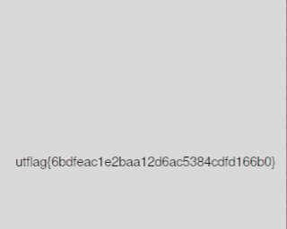

# [Forensics] 1 Frame per Minute - (50 pts)

## Description

I recently received this signal transmission known as SSTV in a mode called Martian? This technology is all very old so I'm not sure what to do with it. Could you help me out?

by phleisch

## Solution

By using [SSTV Decoder](https://github.com/colaclanth/sstv), we can get the picture out.

```sh
$ sstv -d signals.wav -o res.png
```



Flag `utflag{6bdfeac1e2baa12d6ac5384cdfd166b0}`
