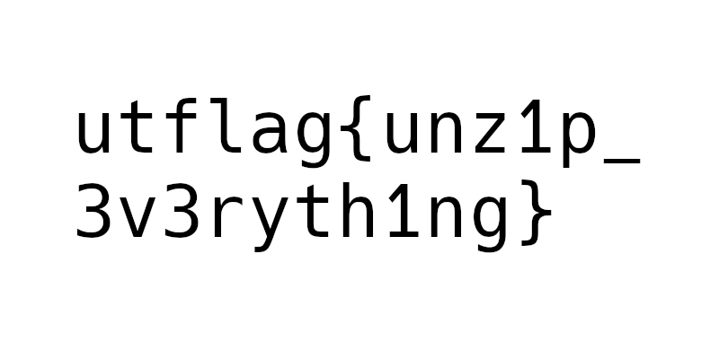

# [Forensics] The Legend of Hackerman, Pt. 2 - (50 pts)

## Description

Ok, I've received another file from Hackerman, but it's just a Word Document? He said that he attached a picture of the flag, but I can't find it...

_by balex_

## Solution

The docx filtype is actually a zip file.

Unziping it, and you'll find the flag in one of the picutures.

Flag `utflag{unz1p_3v3ryth1ng}`
