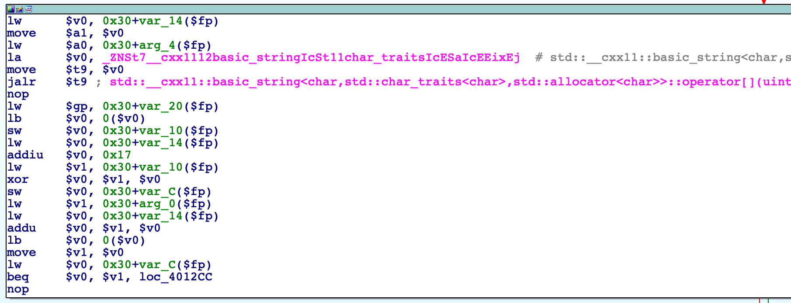

# [Reverse Engineering] babymips - (50 pts)

## Description

what's the flag?

by Dan

## Solution

As the picture shows, it add 0x17 to the index then xor the character, after that, compare it to the hardcoded value.

We can get the flag by reversing the process.

[solve.py](solve.py)

Flag ``utflag{mips_cpp_gang_5VDm:~`N]ze;\)5%vZ=C'C(r#$q=*efD"ZNY_GX>6&sn.wF8$v*mvA@'}``
