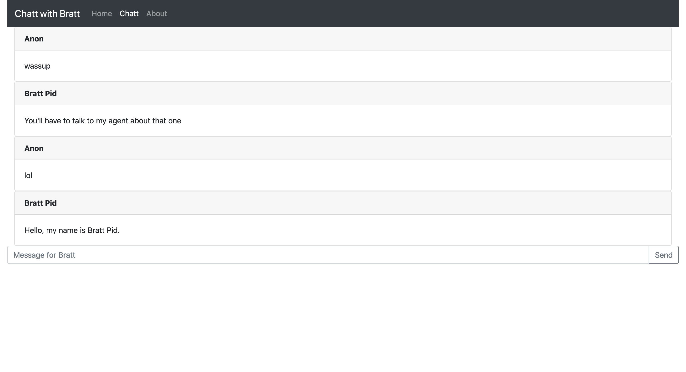
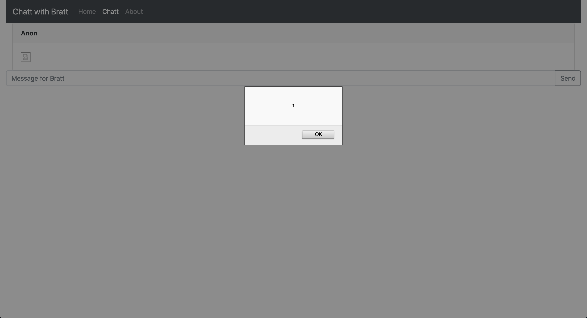

# [Web] Chatt with Bratt - (50 pts)

## Description

After announcing that he would be having an anonymous 1-on-1 AMA with randomly chosen, adoring fans, an engineering team hacked together a web app and likely forget to patch some obvious security holes. Anyway, you're one of the lucky fans chosen to chatt with Bratt Pid! Have fun: [web3.utctf.live:8080](http://web3.utctf.live:8080)

_by phleisch_

## Solution

The site is a simple chat room.

By sending ``, we can get this:

Thus we can use XSS to get the flag in the cookie from Bratt Pid: ``

Flag `utflag{95debad95cfb106081f33ceadc36bf9c}`
