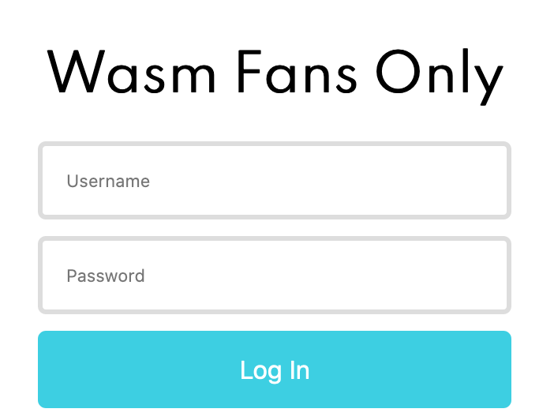

# [Web] Wasm Fans Only - (1951 pts)

## Description

[link](http://wasmfans.ga)

_by gg_

## Solution

After clicking the log in button, it'll call `Module._verify_flag()` to verify the your input on the password field.



So, let's reverse the `_verify_flag()` function.

First, download the `verifyFlag.wasm` file and use [wabt](https://github.com/WebAssembly/wabt) to convert it into a C file.

```sh
$ wasm2c verifyFlag.wasm -o verifyFlag.c
```

By doing this, we will get a higher level code in C.
However, it's not clean enough.
To make it cleaner, we can compile it then decompile it.

```sh
$ mv wabt/wasm-rt* .
$ gcc -c verifyFlag.c -o verifyFlag.o
```

Open `verifyFlag.o` in your decompiler and keep diving into `_verify_flag()`.

The code below is generating the code `document.getElementById("flag").value`, and store the value at offset 136

```cpp
v0 = i64_load(Z_envZ_memory, 1454LL);
i64_store(Z_envZ_memory, (v37 + 174), v0);
v1 = i64_load(Z_envZ_memory, 1448LL);
i64_store(Z_envZ_memory, (v37 + 168), v1);
v2 = i64_load(Z_envZ_memory, 1440LL);
i64_store(Z_envZ_memory, (v37 + 160), v2);
v3 = i64_load(Z_envZ_memory, 1432LL);
i64_store(Z_envZ_memory, (v37 + 152), v3);
v4 = i64_load(Z_envZ_memory, 1424LL);
i64_store(Z_envZ_memory, (v37 + 144), v4);
i32_store(Z_envZ_memory, (v37 + 140), 0LL);
while ( i32_load(Z_envZ_memory, (v37 + 140)) < 38 )
{
  v5 = i32_load(Z_envZ_memory, (v37 + 140)) + v37 + 144;
  v6 = i32_load8_u(Z_envZ_memory, v5);
  i32_store8(Z_envZ_memory, v5, v6 ^ 0x37u);
  v7 = i32_load(Z_envZ_memory, (v37 + 140)) + 1;
  i32_store(Z_envZ_memory, (v37 + 140), v7);
}
v8 = Z_envZ_getStringZ_ii((v37 + 144));
i32_store(Z_envZ_memory, (v37 + 136), v8);
```

The code below is generating the code `window.location.hostname`, which is `wasmfans.ga`, and store it at offset 88

```cpp
v9 = i32_load8_u(Z_envZ_memory, 1496LL);
i32_store8(Z_envZ_memory, (v37 + 120), v9);
v10 = i64_load(Z_envZ_memory, 1488LL);
i64_store(Z_envZ_memory, (v37 + 112), v10);
v11 = i64_load(Z_envZ_memory, 1480LL);
i64_store(Z_envZ_memory, (v37 + 104), v11);
v12 = i64_load(Z_envZ_memory, 1472LL);
i64_store(Z_envZ_memory, (v37 + 96), v12);
i32_store(Z_envZ_memory, (v37 + 92), 0LL);
while ( i32_load(Z_envZ_memory, (v37 + 92)) < 25 )
{
  v13 = i32_load(Z_envZ_memory, (v37 + 92)) + v37 + 96;
  v14 = i32_load8_u(Z_envZ_memory, v13);
  i32_store8(Z_envZ_memory, v13, v14 ^ 0x60u);
  v15 = i32_load(Z_envZ_memory, (v37 + 92)) + 1;
  i32_store(Z_envZ_memory, (v37 + 92), v15);
}
v16 = Z_envZ_getStringZ_ii((v37 + 96));
i32_store(Z_envZ_memory, (v37 + 88), v16);
```

The code below is xoring the data start from offset 60 to `strlen(offset_88)`, which runs 11 times.

```cpp
i32_store(Z_envZ_memory, (v37 + 60), 0LL);
while ( 1 )
{
  v19 = i32_load(Z_envZ_memory, (v37 + 60));
  v20 = i32_load(Z_envZ_memory, (v37 + 88));
  if ( v19 >= f25(v20) )
    break;
  v21 = i32_load(Z_envZ_memory, (v37 + 88));
  v22 = i32_load(Z_envZ_memory, (v37 + 60)) + v21;
  v23 = i32_load8_u(Z_envZ_memory, v22);
  v24 = i32_load(Z_envZ_memory, (v37 + 60)) % 16 + v37 + 64;
  v25 = v23 ^ i32_load8_u(Z_envZ_memory, v24);
  i32_store8(Z_envZ_memory, v24, v25);
  v26 = i32_load(Z_envZ_memory, (v37 + 60)) + 1;
  i32_store(Z_envZ_memory, (v37 + 60), v26);
}
```

**The Main Part**

Here is the main part for checking the flag.

`f23()` is the making sure the input starts with `utflag{` and ends with `}`.

If so, `aes_encrypt_block(plaintext, key, ciphertext)`.
Note that the `plaintext` is the input data, `key` is the result after xoring in the previous process.

Then check the ciphertext matched against the data start from offset 32.

```cpp
if ( f23(v29) == 0 )
{
  Z_envZ_loseZ_vv();
}
else
{
  i64_store(Z_envZ_memory, (v37 + 16), 0LL);
  i64_store(Z_envZ_memory, (v37 + 24), 0LL);
  v30 = i32_load(Z_envZ_memory, (v37 + 136)) + 7;
  aes_encrypt_block(v30, (v37 + 64), (v37 + 16));
  i32_store(Z_envZ_memory, (v37 + 12), 0LL);
  while ( i32_load(Z_envZ_memory, (v37 + 12)) < 16 )
  {
    v31 = i32_load(Z_envZ_memory, (v37 + 12)) + v37 + 32;
    v32 = i32_load8_u(Z_envZ_memory, v31);
    v33 = i32_load(Z_envZ_memory, (v37 + 12)) + v37 + 16;
    if ( v32 != i32_load8_u(Z_envZ_memory, v33) )
    {
      Z_envZ_loseZ_vv();
      goto LABEL_22;
    }
    v34 = i32_load(Z_envZ_memory, (v37 + 12)) + 1;
    i32_store(Z_envZ_memory, (v37 + 12), v34);
  }
  v35 = i32_load(Z_envZ_memory, (v37 + 136));
  Z_envZ_winZ_vi(v35);
}
```

After the reversing process, we can simply decrypt the data start from offset 32 and decrypt it with the key.

```python
hostname = 'wasmfans.ga'
s = data[1504 - 1024:1504 - 1024 + 16]
i = 0
while i < len(hostname):
    s[i] ^= ord(hostname[i])
    i += 1

ct = data[1520 - 1024:1520 - 1024 + 16]

key = ''.join(chr(i) for i in s)
ct = ''.join(chr(i) for i in ct)

aes = AES.new(key, AES.MODE_ECB)
pt = aes.decrypt(ct)
print('utflag{{{}}}'.format(pt))
```

Flag `utflag{fPRv38aICAz31Ix7}`
