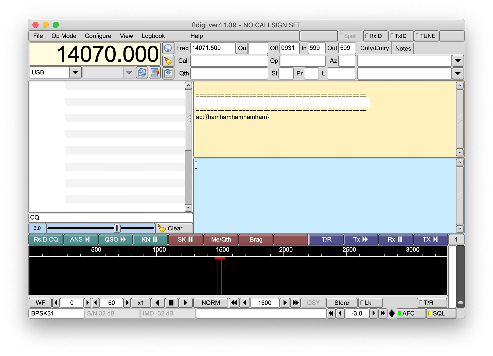

# [Misc] PSK

> Points: 90
> Solves: 282

## Description

My friend sent my yet another mysterious recording...

He told me he was inspired by PicoCTF 2019 and made his own transmissions.
I've looked at it, and it seems to be really compact and efficient.

Only 31 bps!!

See if you can decode [what he sent to me](transmission.wav). It's in actf{} format

## Solution

As the `exiftool` command shows, this wave file might be in the format of BPSK31.

```sh
$ exiftool transmission.wav
[...]
Software                        : fldigi-4.0.17 (libsndfile-1.0.27)
Comment                         : BPSK31 freq=1.941
[...]
```

We can use [fldigi](http://www.w1hkj.com/) to reveal the content of this transmission.



Flag `actf{hamhamhamhamham}`
