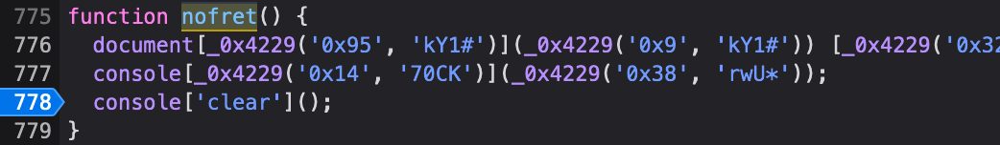
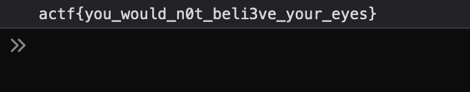

# [Web] Consolation

> Points: 50
> Solves: 621

## Description

I've been feeling down lately... [Cheer me up](https://consolation.2020.chall.actf.co)!

## Solution

It'll call `nofret()` once the button was clicked.

`nofret()`:

It'll log the flag in the console then clear it immediately.

We can set a breakpoint right before it was cleared.

Flag `actf{you_would_n0t_beli3ve_your_eyes}`
